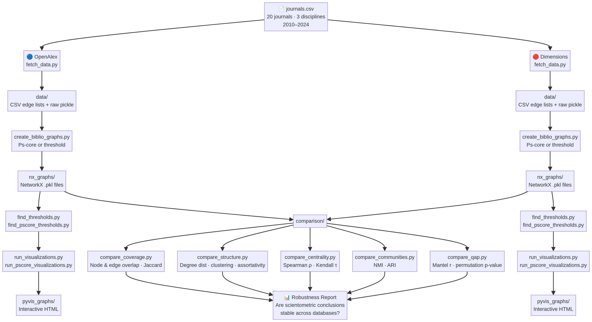

# How Much Do Scientometric Conclusions Depend on the Data Source?

[](https://comparative-bibiometric-study-of-openalex-dimenionsai.streamlit.app/) [Open Streamlit App →](https://comparative-bibiometric-study-of-openalex-dimenionsai.streamlit.app/)

A reproducible data collection and network analysis pipeline for assessing the robustness of scientometric networks across bibliographic infrastructures. 

This project supports the study:

> *"How Much Do Scientometric Conclusions Depend on the Data Source? A Cross-Disciplinary Analysis of OpenAlex and Dimensions Networks in Scientometrics, Information Science, and Digital Health (2010–2024)"*

The core question is not whether OpenAlex and Dimensions produce identical networks (they do not), but rather: **how stable are scientific conclusions under changes in bibliographic infrastructure?** If a researcher constructs the same corpus from both databases, do the central authors, community structures, field boundaries, and concept networks differ? This pipeline enables a formal empirical analysis of scientometric robustness.



---

## Journal Corpus

20 journals across three thematic clusters, covering the period **2010–2024** (~45,000–50,000 articles). The full list is maintained in the shared `journals.csv` at the project root.

| Journal | ISSN | Electronic ISSN | OpenAlex ID | Cluster |
|---|---|---|---|---|
| Scientometrics | 0138-9130 | 1588-2861 | S148561398 | Scientometrics & Informetrics |
| Journal of Informetrics | 1751-1577 | 1875-5879 | S205292342 | Scientometrics & Informetrics |
| Quantitative Science Studies | 2641-3337 | 2641-3337 | S4210195326 | Scientometrics & Informetrics |
| Research Evaluation | 0958-2029 | 1471-5449 | S16793705 | Scientometrics & Informetrics |
| JASIST | 2330-1635 | 2330-1643 | S4210197613 | Scientometrics & Informetrics |
| Social Science Computer Review | 0894-4393 | 1552-8286 | S127118166 | Scientometrics & Informetrics |
| Research Policy | 0048-7333 | 1873-7625 | S9731383 | Scientometrics & Informetrics |
| Information Processing & Management | 0306-4573 | 1873-5371 | S174847851 | Information Science |
| Journal of Information Science | 0165-5515 | 1741-6485 | S68913162 | Information Science |
| Aslib Journal of Information Management | 2050-3806 | 2050-3806 | S4210181081 | Information Science |
| Library & Information Science Research | 0740-8188 | 1879-1034 | S186163925 | Information Science |
| Online Information Review | 1468-4527 | 1468-4527 | S931548824 | Information Science |
| Journal of Documentation | 0022-0418 | 1758-7379 | S10082577 | Information Science |
| The Lancet Digital Health | 2589-7500 | 2589-7500 | S4210237014 | AI in Health / Medicine |
| npj Digital Medicine | 2398-6352 | 2398-6352 | S4210195431 | AI in Health / Medicine |
| Artificial Intelligence in Medicine | 0933-3657 | 1873-2860 | S42468263 | AI in Health / Medicine |
| JAMIA | 1527-974X | 1527-974X | S129839026 | AI in Health / Medicine |
| Journal of Medical Internet Research | 1438-8871 | 1438-8871 | S17147534 | AI in Health / Medicine |
| Journal of Biomedical Informatics | 1532-0464 | 1532-0480 | S11622463 | AI in Health / Medicine |
| Digital Health | 2055-2076 | 2055-2076 | S4210188408 | AI in Health / Medicine |

---

## Four Scientometric Networks and Normalization

Each pipeline produces four network types. Because raw counts can be heavily biased by paper size (e.g., medical papers often have many more authors and references than scientometrics papers) or hub entities (e.g., highly frequent concepts), **fractional or cosine normalization is applied during graph creation**.

| Network | Node Type | Edge Criterion | Normalization |
|---|---|---|---|
| **Co-authorship** | Author | Co-authored at least one paper | **Strict Fractional** (weight += 1/max(1, k−1) per paper, where k = number of authors) |
| **Bibliographic Coupling** | Paper | Cite at least one common reference | **Cosine** (normalized by reference list lengths) |
| **Concept Co-occurrence** | Concept / Keyword | Appear together in at least one paper | **Cosine** (normalized by concept frequencies) |
| **Research Field Sharing** | Field / FOR Category | Co-assigned to at least one paper | **Cosine** (normalized by field frequencies) |

---

## Prerequisites

```bash
pip install requests pandas networkx pyvis
```

---

## Setup

### OpenAlex

OpenAlex does not require an API key for basic access, but providing one unlocks higher rate limits. A contact email is used separately to access the **polite pool**.

Edit `OpenAlex/key.txt`:
```
your_email@example.com
YOUR_OPENALEX_API_KEY_HERE
```
- **Line 1:** your contact email (required for polite pool)
- **Line 2:** your OpenAlex API key (optional)

To request an OpenAlex API key visit: [https://openalex.org/](https://openalex.org/)

### Dimensions.ai

A Dimensions API key is required. Edit `Dimensions/key.txt`:
```
YOUR_DIMENSIONS_API_KEY_HERE
```
To obtain a key visit: [https://www.dimensions.ai/](https://www.dimensions.ai/)

---

## Pipeline

Run the scripts in sequence from within each subfolder. **Always `cd` into the subfolder first**, as all paths are relative.

```bash
cd OpenAlex
python fetch_data.py
python create_biblio_graphs.py
python find_thresholds.py          # optional: find degree thresholds for ~130 nodes
python find_pscore_thresholds.py   # optional: find Ps-core thresholds for ~130 nodes
python run_visualizations.py       # degree-threshold visualizations
python run_pscore_visualizations.py  # Ps-core visualizations
```

Repeat identically from the `Dimensions/` folder.

---

## Step 1 — Data Fetching (`fetch_data.py`)

Fetches all articles from the 20 target journals within the 2010–2024 window. Both scripts read the shared `../journals.csv` at the project root.

**OpenAlex:** Uses cursor-based pagination (200 records per page) against the `/works` endpoint, filtering by `primary_location.source.id`, `publication_year`, and `type:article`. Fields fetched: `id`, `doi`, `title`, `publication_year`, `primary_location`, `authorships`, `referenced_works`, `concepts`, `topics`.

**Dimensions:** Authenticates via `POST /api/auth.json` to obtain a JWT token, then issues DSL queries using `limit`/`skip` pagination, filtering by ISSN list, year range, and `type = "article"`. Fields fetched: `id`, `doi`, `title`, `year`, `journal`, `authors`, `researchers`, `reference_ids`, `concepts`, `concepts_scores`, `category_for`, `open_access`, `times_cited`, `field_citation_ratio`.

**Outputs to `data/`:**

| File | Contents |
|---|---|
| `openalex_raw.pkl` / `dimensions_raw.pkl` | Pickled `pd.DataFrame` — one row per article, all fetched fields preserved |
| `*_nodes.csv` | Flat article catalog (id, doi, title, year, journal) |
| `*_coauth_edges.csv` | Author–author pairs per paper |
| `*_bib_edges.csv` | Paper–reference pairs |
| `*_concept_edges.csv` | Paper–concept pairs |
| `*_field_edges.csv` | Paper–field pairs |

---

## Step 2 — Graph Construction (`create_biblio_graphs.py`)

Reads the CSV edge lists and constructs four normalized NetworkX graphs, serialised as pickle files in `nx_graphs/`. The script offers two extraction modes set via `EXTRACTION_MODE` at the top of the file. The recommended mode, `"ps_core"`, extracts the maximal subgraph where every node's weighted degree meets a per-graph threshold (`PS_CORE_T_COAUTH`, `PS_CORE_T_BIB`, `PS_CORE_T_CONCEPT`, `PS_CORE_T_FIELD`), using the Batagelj-Zaveršnik O(m) peeling algorithm. The legacy mode, `"threshold"`, removes edges below fixed weight cutoffs (`MIN_COAUTH_WEIGHT`, `MIN_SHARED_REFS`, `MIN_CONCEPT_COOC`, `MIN_FIELD_COOC`) and nodes below a minimum degree (`MIN_DEGREE`). Set any parameter to `0` for no filtering. All threshold values are encoded in the output filename so multiple versions coexist safely in `nx_graphs/`.

---

## Step 3 — Finding Visualization Thresholds

Two helper scripts identify threshold values that reduce each graph to a manageable size (~70–130 nodes) for interactive visualization. `find_thresholds.py` computes the weighted degree of all nodes and reports the cutoff values yielding approximately 130 and 70 nodes for each graph. `find_pscore_thresholds.py` uses the Batagelj-Zaveršnik O(m) peeling algorithm to compute the full Ps-core decomposition in a single pass and reports the corresponding Ps-core threshold values. Both scripts print their results to the terminal; the values are then hardcoded into `run_visualizations.py` and `run_pscore_visualizations.py` respectively.

---

## Step 4 — Visualization

Two convenience scripts generate all HTML files in one command: `run_visualizations.py` uses the weighted degree thresholds and `run_pscore_visualizations.py` uses the Ps-core thresholds. For custom threshold values or single-graph visualization, `visualize_biblio_graphs.py` accepts a filename, an optional `--min_degree` argument, and an optional `--no_labels` flag that hides node labels (showing them only on hover), which is useful for larger graphs. All HTML files are self-contained with JavaScript embedded inline and open directly in any browser without a server; each includes a title displaying the graph type, normalization method, and threshold used. For large untruncated graphs that exceed browser limits, `export_to_vosviewer.py` writes map and network `.txt` files to `vosviewer_files/` for use with [VOSviewer](https://www.vosviewer.com/), which handles graphs of hundreds of thousands of nodes efficiently and exports PNG/SVG screenshots suitable for publication.

---

## Notes

- The Dimensions DSL API imposes a pagination ceiling (typically 50,000 records via `skip`). If the corpus exceeds this limit, the script stops gracefully and reports the total fetched.
- All output directories (`data/`, `nx_graphs/`, `pyvis_graphs/`, `vosviewer_files/`) are created automatically on first run.
- Multiple versions of the same graph type produced with different thresholds coexist safely in `nx_graphs/` thanks to the stamped filename convention.
- The `find_pscore_thresholds.py` script uses the Batagelj-Zaveršnik O(m) peeling algorithm and completes in seconds even for graphs with hundreds of thousands of nodes and tens of millions of edges.

---

## Network Comparison Methodology

### Theoretical Framing: Epistemic Infrastructures, Not Alternative Representations

A foundational assumption that must be made explicit — and then problematised — is the claim that OpenAlex and Dimensions are two windows onto the same underlying scholarly system. This assumption is not self-evident. OpenAlex and Dimensions differ not only in coverage but in their indexing policies, metadata pipelines, author disambiguation systems, concept taxonomies, and citation matching algorithms. These are not incidental implementation differences; they reflect distinct epistemic choices about what counts as a publication, who counts as an author, and how concepts are defined and assigned.

Consequently, differences in the resulting networks are not necessarily errors or noise. They may be manifestations of fundamentally different epistemic infrastructures — in the sense discussed by Wouters (1999) and Leydesdorff & Milojević (2015) — each constructing a partial and theory-laden representation of the scholarly record. The scientific question is therefore not "which database is correct?" but rather "how much do the conclusions a researcher would draw depend on which infrastructure they used?" This reframing is what elevates the study from a database comparison to an analysis of the robustness and reproducibility of scientometric network analysis.

The comparison operates at four complementary levels of analysis.

### Alignment Quality and Its Limits

All node-aligned comparisons (points 2–4 below) depend critically on the quality of the identifier-based alignment. For co-authorship networks, alignment relies on ORCID, whose coverage in OpenAlex is approximately 40–60% of authors depending on field and publication year; Dimensions uses its own proprietary disambiguation system. A node that appears in both databases under the same ORCID may still represent a different set of papers if the two databases disagree on which papers that author wrote. For bibliographic coupling and concept co-occurrence networks, alignment relies on DOI and concept label matching respectively, which are generally more reliable but not immune to errors.

Low agreement in QAP, centrality rank correlations, or community overlap should therefore be interpreted with caution: it may reflect genuine structural differences in the networks, or it may reflect alignment failures. To assess this, the comparison scripts report the fraction of nodes in each network that carry a persistent identifier, the fraction of those identifiers that overlap between databases, and — where possible — a sensitivity analysis restricting the comparison to high-confidence matches. This subsection of the analysis should be reported prominently in any paper derived from this pipeline, as it is the single greatest threat to the validity of the node-aligned comparisons.

### 1. Structural Comparison (Full Graphs, No Alignment Required)

For each of the four network types, the full untruncated graphs from both databases are compared on the following global statistics:

- **Degree distribution**: log-log plots of the complementary cumulative degree distribution P(K ≥ k) for both raw and normalized graphs. A two-sample Kolmogorov-Smirnov test is used to assess whether the two distributions are statistically distinguishable.
- **Clustering coefficient**: global and average local clustering coefficients.
- **Assortativity**: degree assortativity coefficient (Newman, 2002), measuring whether high-degree nodes preferentially connect to other high-degree nodes.
- **Ps-core decomposition profile**: the distribution of Ps-core levels across nodes, computed via the Batagelj-Zaveršnik O(m) peeling algorithm (Batagelj & Zaveršnik, 2003). This provides a scale-invariant fingerprint of the network's hierarchical core-periphery structure.

These measures are database-agnostic and require no node alignment.

### 2. Node-Aligned Comparison (Intersection of Identifiable Nodes)

Where nodes can be matched across databases using persistent identifiers — ORCID for authors, DOI for papers, ROR for institutions — the comparison is extended to the aligned subgraph. On this intersection:

- **Centrality rank correlation**: weighted degree centrality, betweenness centrality, and PageRank are computed for each aligned node in both databases. Spearman's ρ and Kendall's τ are reported for each centrality measure, quantifying whether the two databases agree on which entities are most central.
- **Community structure overlap**: community detection (e.g., Louvain or label propagation) is run independently on each database's graph. The resulting partitions are compared on the aligned nodes using Normalised Mutual Information (NMI) and the Adjusted Rand Index (ARI), following Fortunato (2010).

### 3. Edge Overlap Analysis

For each network type, the edge sets of the two databases are compared on the aligned node intersection:

- **Jaccard similarity** of the edge sets: |E_OA ∩ E_DIM| / |E_OA ∪ E_DIM|.
- **Directed overlap**: the fraction of OA edges also present in Dimensions, and the fraction of Dimensions edges also present in OA. Asymmetry in these fractions reveals systematic coverage differences.
- **Weight correlation**: for edges present in both databases, the Spearman correlation of edge weights quantifies whether the two databases agree not just on the existence of a link but on its strength.

This approach directly quantifies coverage differences independently of node disambiguation, following the methodology of Visser, van Eck, & Waltman (2021).

### 4. Matrix Correlation via QAP (Quadratic Assignment Procedure)

Points 1–3 evaluate coverage and descriptive structural similarities. Point 4 tests whether the relational structure (the pattern of connections) is statistically consistent across databases, controlling for the fact that two random sparse matrices over the same node set would share very few edges by chance.

For each network type, the weighted adjacency matrices from OpenAlex and Dimensions are constructed over the aligned node intersection. The **Quadratic Assignment Procedure (QAP)** (Hubert & Schultz, 1976; Krackhardt, 1988) is then applied. QAP tests whether the two matrices are correlated beyond what would be expected by chance, by permuting the rows and columns of one matrix simultaneously (preserving its internal structure) and recomputing the correlation across thousands of permutations.

The output reports the **Mantel correlation coefficient** (*r*) and the **permutation p-value**. A high, significant correlation indicates that the two databases agree on who is connected to whom and how strongly. A low or non-significant correlation indicates that the databases produce structurally different networks for the same corpus.

**Limitation**: QAP assumes the node alignment is correct. If the persistent identifiers used for alignment (e.g., ORCID) contain disambiguation errors or omissions, the test will underestimate the true structural similarity between the databases.

### References

- Barabási, A.-L., & Albert, R. (1999). Emergence of scaling in random networks. *Science*, 286(5439), 509–512.
- Batagelj, V., & Zaveršnik, M. (2003). An O(m) algorithm for cores decomposition of networks. *arXiv:cs/0310049*.
- Clauset, A., Shalizi, C. R., & Newman, M. E. J. (2009). Power-law distributions in empirical data. *SIAM Review*, 51(4), 661–703.
- Fortunato, S. (2010). Community detection in graphs. *Physics Reports*, 486(3–5), 75–174.
- Butts, C. T. (2008). Social network analysis with sna. *Journal of Statistical Software*, 24(6).
- Hubert, L., & Schultz, J. (1976). Quadratic assignment as a general data analysis strategy. *British Journal of Mathematical and Statistical Psychology*, 29(2), 190–241.
- Krackhardt, D. (1988). Predicting with networks: Nonparametric multiple regression analysis of dyadic data. *Social Networks*, 10(4), 359–381.
- Newman, M. E. J. (2002). Assortative mixing in networks. *Physical Review Letters*, 89(20), 208701.
- Visser, M., van Eck, N. J., & Waltman, L. (2021). Large-scale comparison of bibliographic data sources: Scopus, Web of Science, Dimensions, Crossref, and Microsoft Academic Scholar. *Quantitative Science Studies*, 2(1), 20–41.
- Wouters, P. (1999). *The Citation Culture*. PhD thesis, University of Amsterdam.
- Leydesdorff, L., & Milojević, S. (2015). Scientometrics. In J. D. Wright (Ed.), *International Encyclopedia of the Social & Behavioral Sciences* (2nd ed., pp. 322–327). Elsevier.

---

## License

Copyright (c) 2026 Moses Boudourides. This project is licensed under the [MIT License](https://github.com/mboudour/Comparative-Bibiometric-Study-of-OpenAlex-Dimenions.ai/blob/main/LICENSE).
